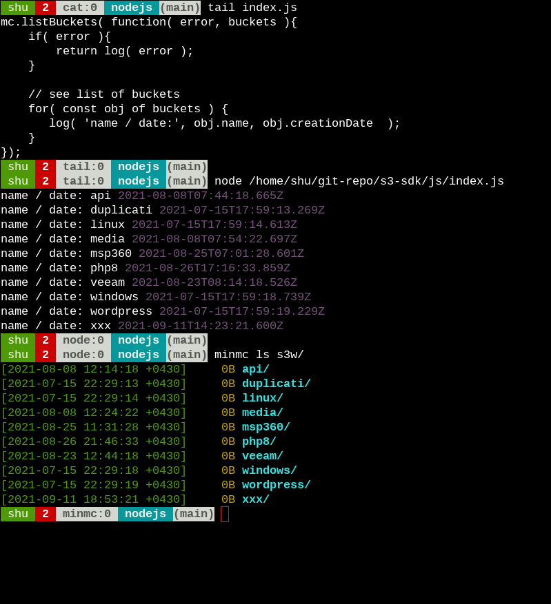

# Node.js guide for s3

For accessing our S3 storage using Node.js we can use `minio` package provided by [minio](http://min.io/).  

## Instructions

### Initialize the working directory

For Initializing the working directory we can use `npm`:  

```BASH
npm -y init
```

### install the package

For installing the `minio` package using `npm` run:  

```BASH
npm install minio
```

### Assigned variables to Node.js ENV

We can hard-code the credentials and run the code but it is not a best-practice, sample:  

```JS
const Minio = require('minio')

const log = console.log.bind( console );

// constructor
const mc = new Minio.Client({
    endPoint: s3w-shakibamoshiri.s3.ir-west-1.poshtiban.com,
    port: 443,
    useSSL: true,
    accessKey: 'h8dlXfIPoSCcttyyx5Tj',
    secretKey: 'Dg6lL0t30bDYXkk8yq2k7xxJ4jLD1zcgJaYVkFAz'
});

// get list of buckets
mc.listBuckets( function( error, buckets ){
    if( error ){
        return log( error );
    }

    // see list of buckets
    for( const obj of buckets ) {
       log( 'name / date:', obj.name, obj.creationDate  );
    }
});
```

The better is adding variables into the `ENV` and use them in the code (`index.js`):  

index.js:  

```JS
const Minio = require('minio')

const log = console.log.bind( console );

// constructor
const mc = new Minio.Client({
    endPoint: process.env.END_POINT,
    port: 443,
    useSSL: true,
    accessKey: process.env.ACCESS_KEY,
    secretKey: process.env.SECRET_KEY
});

// get list of buckets
mc.listBuckets( function( error, buckets ){
    if( error ){
        return log( error );
    }

    // see list of buckets
    for( const obj of buckets ) {
       log( 'name / date:', obj.name, obj.creationDate  );
    }
});

```

### Run the sample code using Node.js

And run `index.js` this way (1):  

```BASH
END_POINT=s3w-shakibamoshiri.s3.ir-west-1.poshtiban.com ACCESS_KEY=h8dlXfIPoSCcttyyx5Tj SECRET_KEY=Dg6lL0t30bDYXkk8yq2k7xxJ4jLD1zcgJaYVkFAz node index.js
```

Or the other way (2) using `export` command:  

```BASH
export END_POINT=s3w-shakibamoshiri.s3.ir-west-1.poshtiban.com
export ACCESS_KEY=h8dlXfIPoSCcttyyx5Tj
export SECRET_KEY=Dg6lL0t30bDYXkk8yq2k7xxJ4jLD1zcgJaYVkFAz
node.js index.js
```


### Sample output

```BASH
> node index.js
name / date: api 2021-08-08T07:44:18.665Z
name / date: duplicati 2021-07-15T17:59:13.269Z
name / date: linux 2021-07-15T17:59:14.613Z
name / date: media 2021-08-08T07:54:22.697Z
name / date: msp360 2021-08-25T07:01:28.601Z
name / date: php8 2021-08-26T17:16:33.859Z
name / date: veeam 2021-08-23T08:14:18.526Z
name / date: windows 2021-07-15T17:59:18.739Z
name / date: wordpress 2021-07-15T17:59:19.229Z
name / date: xxx 2021-09-11T14:23:21.600Z
```

### Screenshot of output



If you had any questions or issues you can ticket us :)


### Reference

[javascript-client-api-reference.html](javascript-client-api-reference.html)
