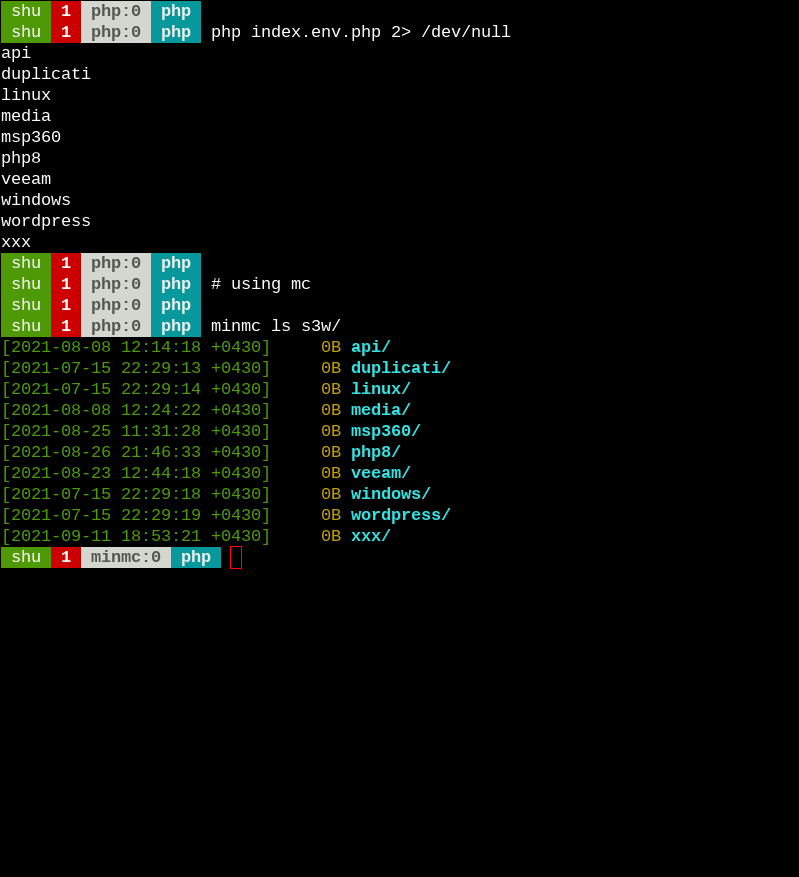

# PHP guide for S3

For accessing our s3 storage using `PHP` we can use:  
 - [Amazon API](https://docs.aws.amazon.com/sdk-for-php/v3/developer-guide/getting-started_installation.html)


## Instruction

Before installing AWS module we should install **composer**. You go to [getcomposer](https://getcomposer.org/download/) and install it.

### Install the module

Make sure you have installed **composer**, after that we can run:  

```bash
composer require aws/aws-sdk-php
```

Notice that a directory named **vendor** is created which contains AWS module, so make sure you are in the right directory.

### Configure the code

Method (1) hard-coding it:  

```php
$s3 = new Aws\S3\S3Client([
        'version' => 'latest',
        'region'  => 'us-east-1',
        'endpoint' => 'https://s3w-shakibamoshiri.s3.ir-west-1.poshtiban.com',
        'use_path_style_endpoint' => true,
        'credentials' => [
                'key'    => 't7XViGJK3LaKMhj9',
                'secret' => 'q7lfyrT5qMHgsCle2DJzUtajsm5xvJrz',
            ],
]);
```

Method (2) using EVN variables:  

```php
$s3 = new Aws\S3\S3Client([
        'version' => 'latest',
        'region'  => 'us-east-1',
        'endpoint' => getenv('END_POINT'),
        'use_path_style_endpoint' => true,
        'credentials' => [
                'key'    =>  getenv('ACCESS_KEY'),
                'secret' => getenv('SECRET_KEY'),
            ],
]);
```

### Run the code

Method (1) if you hard-coded credentials, just run it:  

```bash
php index.php
```

Method (2) using command-line variables:  

```bash
END_POINT=https://s3w-shakibamoshiri.s3.ir-west-1.poshtiban.com ACCESS_KEY=<YOUR-ACCESS-KEY> SECRET_KEY=<YOUR-SECRET-KEY> php index.env.php
```

Method (3) using `export` command:  

```bash
export END_POINT=<YOUR-ENDPOINT>
export ACCESS_KEY=<YOUR-ACCESS-KEY>
export SECRET_KEY=<YOUR-SECRET-KEY>
PHP index.env.php
```
### Code output:

```bash
> php index.env.php
api
duplicati
linux
media
msp360
php8
veeam
windows
wordpress
xxx
```

### Test and Screenshot




