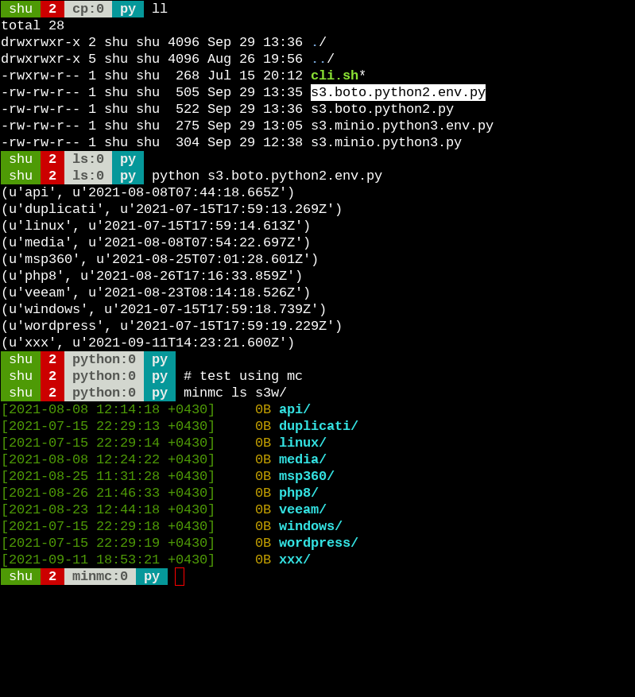

# Python guide to connect to S3 

For accessing our s3 storage we can use:  
 - [minio](https://docs.min.io/docs/python-client-quickstart-guide.html) API (python version 3) - [github](https://github.com/minio/minio-py)  
 - [boto](http://boto.cloudhackers.com/en/latest/s3_tut.html) API (python version 2) - [github](https://github.com/boto/boto)  
 - [boto3](https://boto3.amazonaws.com/v1/documentation/api/latest/index.html) API (python version 3) - [github](https://github.com/boto/boto3)  


## Instruction for Minio

### Install the module

Method (1):  

```bash
pip3 install minio
```

Method (2):  

```bash
git clone https://github.com/minio/minio-py
cd minio-py
sudo python setup.py install
```
### Configure the code

Method (1) hard-code the credentials:  

```js
# Create client with access and secret key.
client = Minio( "s3w-shakibamoshiri.s3.ir-west-1.poshtiban.com", "t7XViGJK3LaKMhj9", "q7lfyrT5qMHgsCle2DJzUtajsm5xvJrz")
```

Method (2), assign into variables in command-line:  

```bash
# pattern
END_POINT=<your-end-point> ACCESS_KEY=<your-access-key> SECRET_KEY=<your-secret-key> python3 your-file.py
```

Method (3), `export`ing the variables:  

```bash
export END_POINT=s3w-shakibamoshiri.s3.ir-west-1.poshtiban.com
export ACCESS_KEY=t7XViGJK3LaKMhj9
export SECRET_KEY=q7lfyrT5qMHgsCle2DJzUtajsm5xvJrz
```

### Run the code

Method (1) if you hard-coded your credentials:  

```bash
python3 s3.minio.python3.py
```

Method (2) if you used `os.environ`:  

```bash
END_POINT=s3w-shakibamoshiri.s3.ir-west-1.poshtiban.com ACCESS_KEY=t7XViGJK3LaKMhj9 SECRET_KEY=q7lfyrT5qMHgsCle2DJzUtajsm5xvJrz python3 s3.minio.python3.env.py
```

Method (3) if you used `export`:  

```bash
python3 s3.minio.python3.env.py
```

### Code output:

```bash
> python3 s3.minio.python3.env.py
api 2021-08-08 07:44:18.665000+00:00
duplicati 2021-07-15 17:59:13.269000+00:00
linux 2021-07-15 17:59:14.613000+00:00
media 2021-08-08 07:54:22.697000+00:00
msp360 2021-08-25 07:01:28.601000+00:00
php8 2021-08-26 17:16:33.859000+00:00
veeam 2021-08-23 08:14:18.526000+00:00
windows 2021-07-15 17:59:18.739000+00:00
wordpress 2021-07-15 17:59:19.229000+00:00
xxx 2021-09-11 14:23:21.600000+00:00
```

### Test and Screenshot 


---

## Instruction for boto


### Install the module

Method (1) using `pip`:  

```bash
pip install boto
```

Method (2) [cloning from main repository](https://pypi.org/project/boto/):  

```bash
git clone git://github.com/boto/boto.git
cd boto
sudo python setup.py install
```


### Configure the code

The same way we applied for Minio, can be used here:  
 - hard-code
 - command-line variables
 - ENV variables


### Run the code

Method (1) for hard-coded code:  

```bash
python s3.boto.python2.py
```

Method (2) if `os.environ` used:  

```bash
END_POINT=s3w-shakibamoshiri.s3.ir-west-1.poshtiban.com \
    ACCESS_KEY=t7XViGJK3LaKMhj9 \
    SECRET_KEY=q7lfyrT5qMHgsCle2DJzUtajsm5xvJrz \
    python3 s3.minio.python3.env.py
```

Method (3) if `export`ing the variables:  

```bash
python s3.boto.python2.env.py
```

### Code output:

```bash
> python s3.boto.python2.env.py
(u'api', u'2021-08-08T07:44:18.665Z')
(u'duplicati', u'2021-07-15T17:59:13.269Z')
(u'linux', u'2021-07-15T17:59:14.613Z')
(u'media', u'2021-08-08T07:54:22.697Z')
(u'msp360', u'2021-08-25T07:01:28.601Z')
(u'php8', u'2021-08-26T17:16:33.859Z')
(u'veeam', u'2021-08-23T08:14:18.526Z')
(u'windows', u'2021-07-15T17:59:18.739Z')
(u'wordpress', u'2021-07-15T17:59:19.229Z')
(u'xxx', u'2021-09-11T14:23:21.600Z')
```

### Test and Screenshot 




### Instruction for boto3

You can refer to its [doc](https://github.com/boto/boto3).


